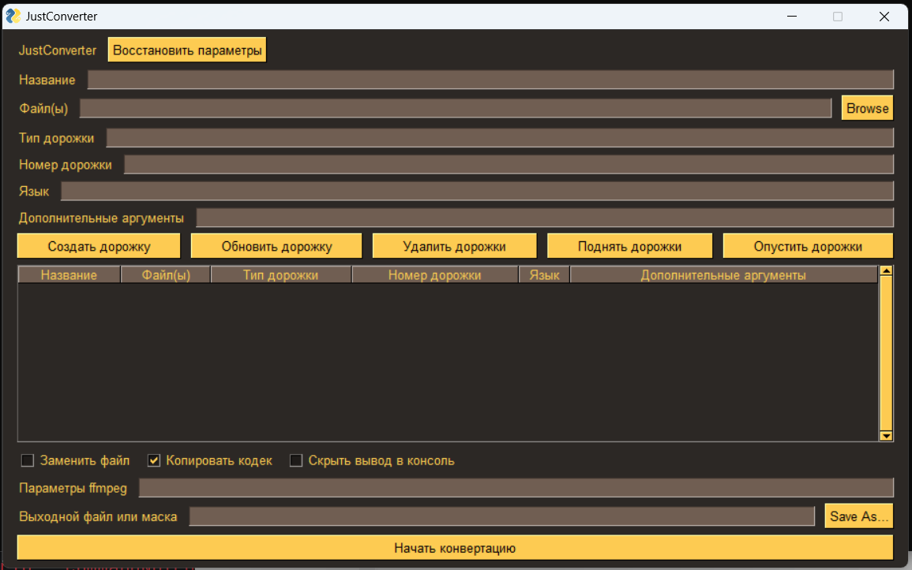

# JustConverter

Converter with comfortable stream map view

# Installation

### Download

Just download latest portable or installer exe file from [releases](https://github.com/DIMNISSV/just-remapper/releases/latest)

#### git clone

> git clone https://github.com/DIMNISSV/just-remapper

> cd JustConverter
 
#### source code archive

Start cmd with administrator.

Download source code from [releases](https://github.com/DIMNISSV/just-remapper/releases).

Instead of `just-remapper.VERSION` write downloaded file name.

> tar -xf just-remapper.VERSION.zip -C "%ProgramFiles%" -p

> cd "%ProgramFiles%\JustConverter.VERSION"

### Create venv

> python -m venv .venv

> .venv/Scripts/activate

### Start

> python -m pip install -r requirements.txt

> python main.py
 
## Using

### Fields:

`Название` `Name` Metadata. Name for stream.

`Файл(ы)` `File(s)` List of files, separated by `;`. 
Consider: count of files in all stream wield be constant.

`Тип дорожки` `Stream type` Type of stream in input file. In ffmpeg format: 
`a` - audio, `v` - video, `s` - subtitles, and etc.

`Номер дорожки` `Stream number` Number of stream in input file.
Starts from zero.

`Язык` `Language` Metadata. Language of output stream.
In the format of 3 characters.

`Дополнительные аргументы` `Additional arguments` Arguments, which will pasted before `-i`.
For example, if write `-ss 10` this input will start from 10 second.

